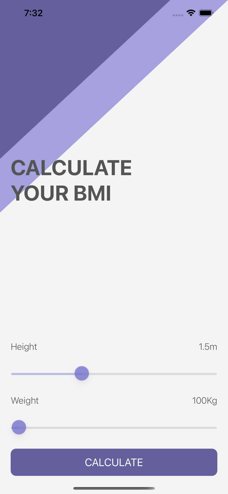
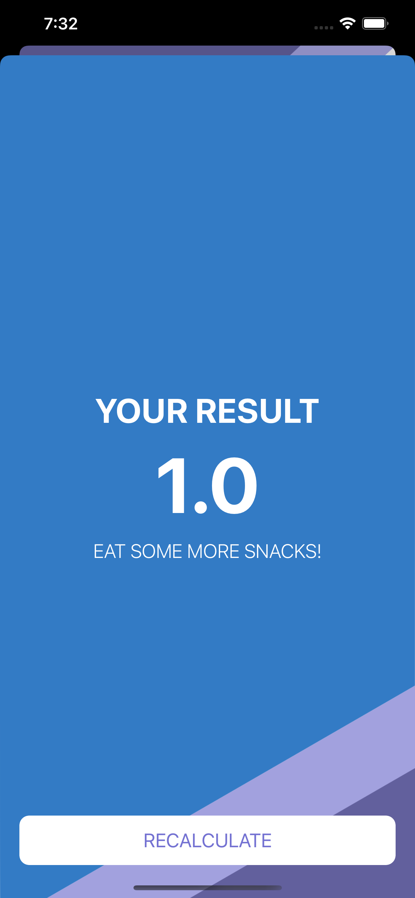

#  BMI Calculator
This project is a challenge of the course IOS & Swift - The Complete IOS App Development Bootcamp

## Screens 

## What was learned

* How to create multi-screen apps with animated navigation.
* Optional binding, optional chaining and the nil coalescing operator.
* How to create classes and difference between classes and structs. 
* Pass by value vs. pass by reference. 
* Formatting Strings. 
* Color literals.
